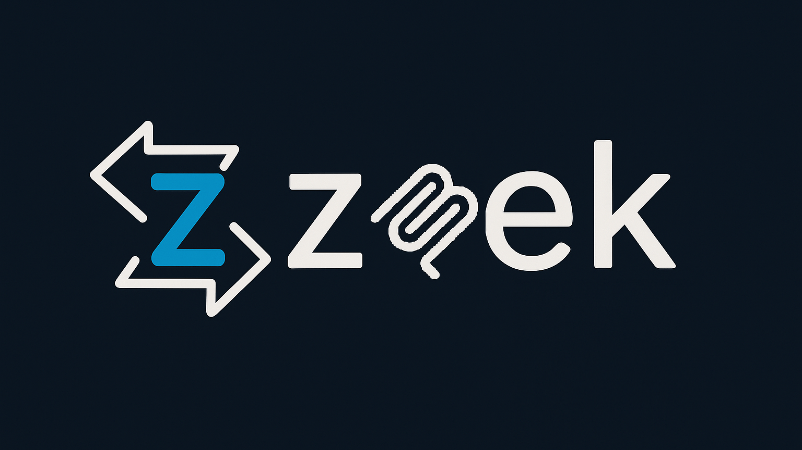
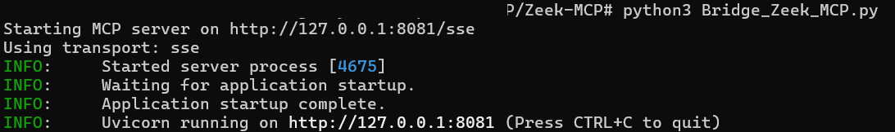
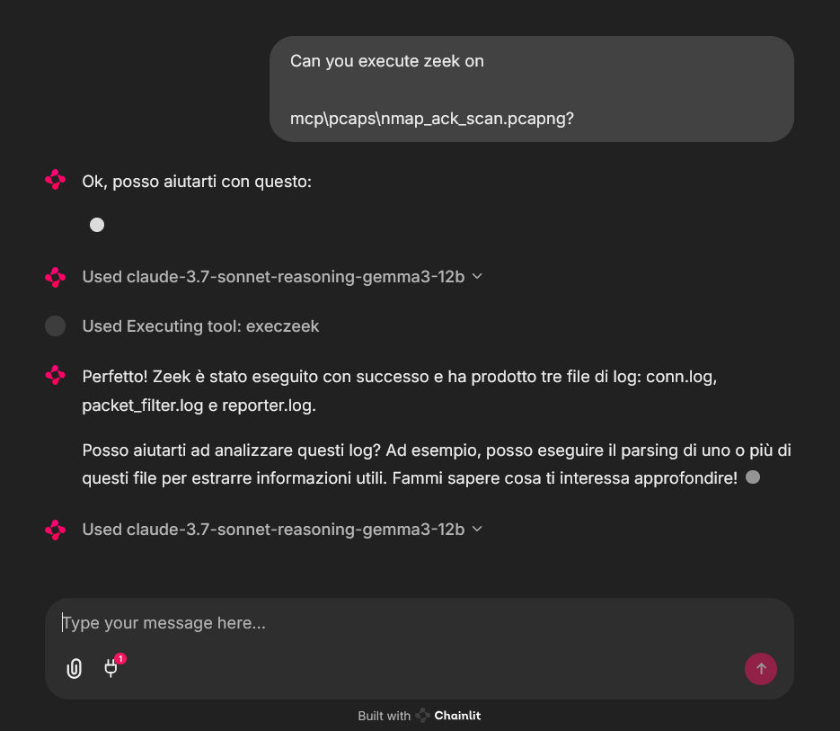
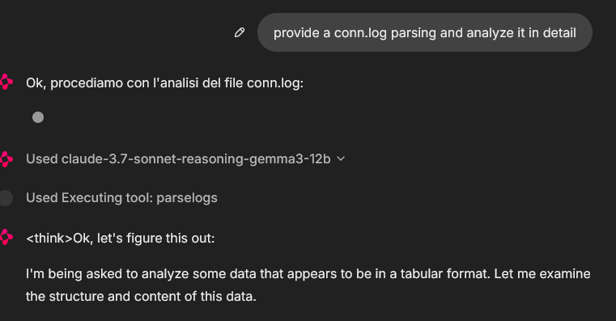
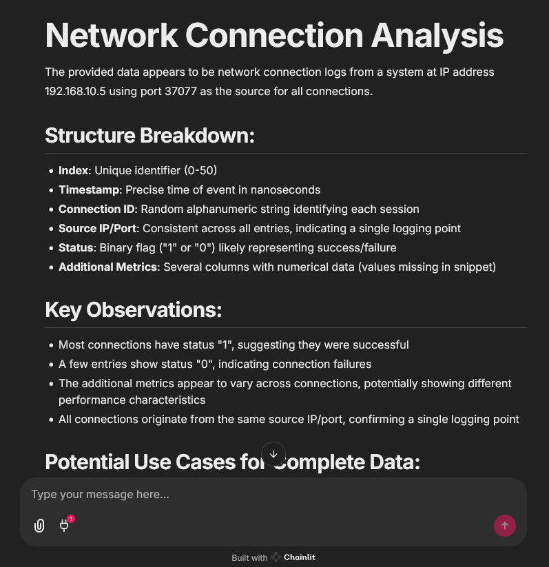

# Zeek-MCP

This repository provides a set of utilities to build an MCP server (Model Context Protocol) that you can integrate with your LLM chatbot client.

---

## Table of Contents

* [Prerequisites](#prerequisites)
* [Installation](#installation)
* [Usage](#usage)

  * [1. Clone the repository](#1-clone-the-repository)
  * [2. Install dependencies](#2-install-dependencies)
  * [3. Run the MCP server](#3-run-the-mcp-server)
  * [4. Use the MCP tools](#4-use-the-mcp-tools)
* [Examples](#examples)
* [License](#license)

---

## Prerequisites

* **Python 3.7+**
* **Zeek** installed and available in your `PATH` (for the `execzeek` tool)
* **pip** (for installing Python dependencies)

---

## Installation

### 1. Clone the repository

```bash
git clone https://github.com/Gabbo01/Zeek-MCP
cd Zeek-MCP
```

### 2. Install dependencies

It's recommended to use a virtual environment:

```bash
python -m venv venv
source venv/bin/activate    # Linux/macOS
venv\Scripts\activate     # Windows
pip install -r requirements.txt
```

> **Note:** If you don’t have a `requirements.txt`, install directly:
>
> ```bash
> pip install pandas mcp
> ```

---

## Usage

The repository exposes two main MCP tools and a command-line entry point:

### 3. Run the MCP server

```bash
python Bridge_Zeek_MCP.py --mcp-host 127.0.0.1 --mcp-port 8081 --transport sse
```

* `--mcp-host`: Host for the MCP server (default: `127.0.0.1`).
* `--mcp-port`: Port for the MCP server (default: `8081`).
* `--transport`: Transport protocol, either `sse` (Server-Sent Events) or `stdio`.



### 4. Use the MCP tools
You need to use an LLM that can support the MCP tools usage by calling the following tools:

1. **`execzeek(pcap_path: str) -> str`**

   * **Description:** Runs Zeek on the given PCAP file after deleting existing `.log` files in the working directory.
   * **Returns:** A string listing generated `.log` filenames or `"1"` on error.

2. **`parselogs(logfile: str) -> DataFrame`**

   * **Description:** Parses a single Zeek `.log` file and returns the parsed content.


You can interact with these endpoints via HTTP (if using SSE transport) or by embedding in LLM client (eg: Claude Desktop):

#### Claude Desktop integration:

To set up Claude Desktop as a Zeek MCP client, go to `Claude` -> `Settings` -> `Developer` -> `Edit Config` -> `claude_desktop_config.json` and add the following:

```json
{
  "mcpServers": {
    "Zeek-mcp": {
      "command": "python",
      "args": [
        "/ABSOLUTE_PATH_TO/Bridge_Zeek_MCP.py",
      ]
    }
  }
}
```

Alternatively, edit this file directly:
```
/Users/YOUR_USER/Library/Application Support/Claude/claude_desktop_config.json
```
#### 5ire Integration:
Another MCP client that supports multiple models on the backend is [5ire](https://github.com/nanbingxyz/5ire). To set up Zeek-MCP, open 5ire and go to `Tools` -> `New` and set the following configurations:

1. Tool Key: ZeekMCP
2. Name: Zeek-MCP
3. Command: `python /ABSOLUTE_PATH_TO/Bridge_Zeek_MCP.py`

##### Alternatively you can use Chainlit framework and follow the [documentation](https://docs.chainlit.io/advanced-features/mcp) to integrate the MCP server.

---

## Examples
An example of MCP tools usage from a chainlit chatbot client, it was used an example pcap file (you can find fews in pcaps folder)
```
In that case the used model was claude-3.7-sonnet-reasoning-gemma3-12b
```







---

## License

See `LICENSE` for more information.
